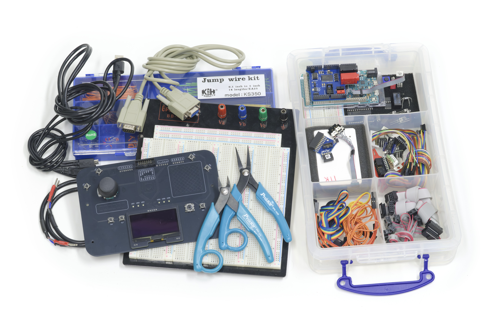
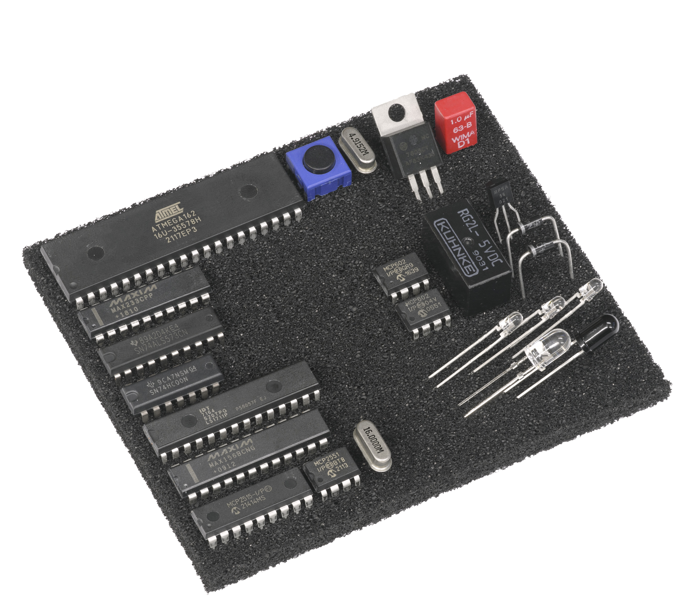
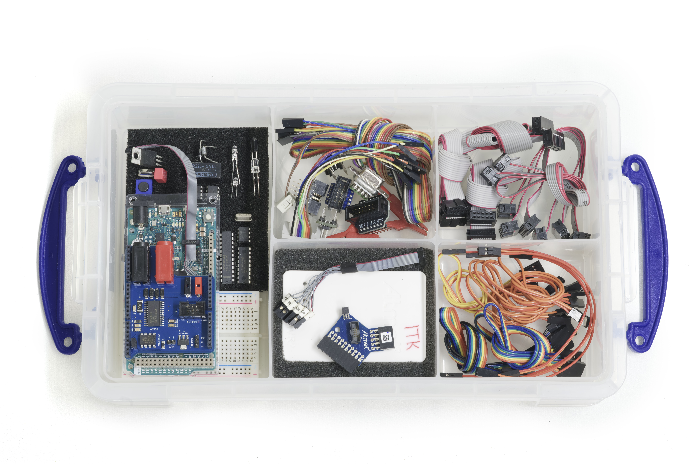
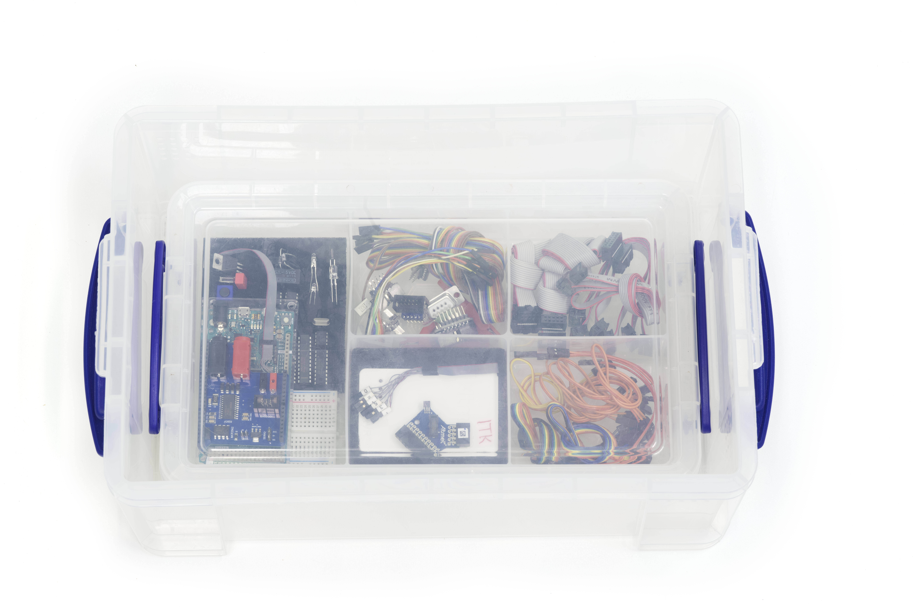
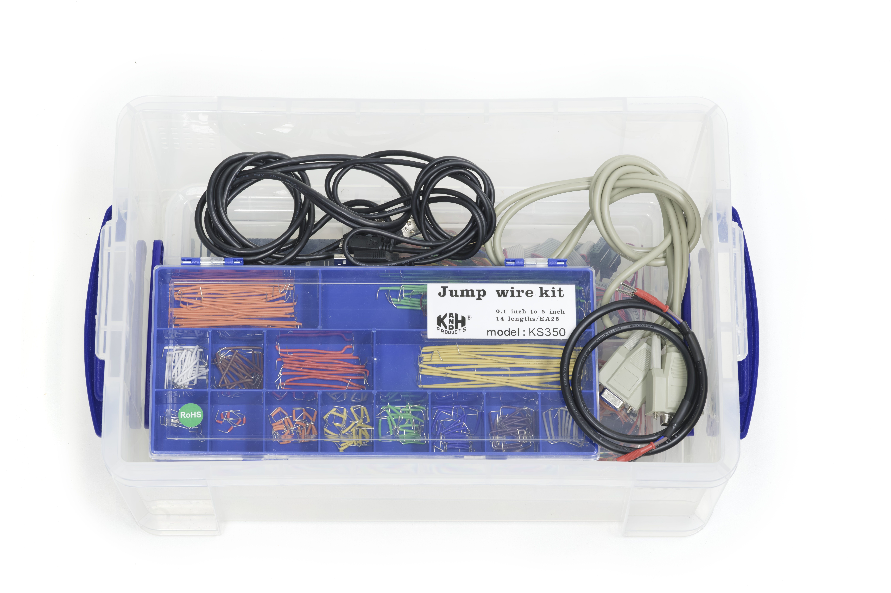
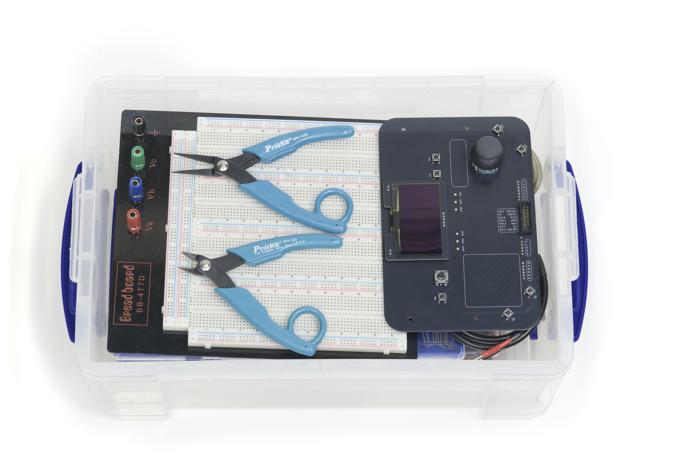
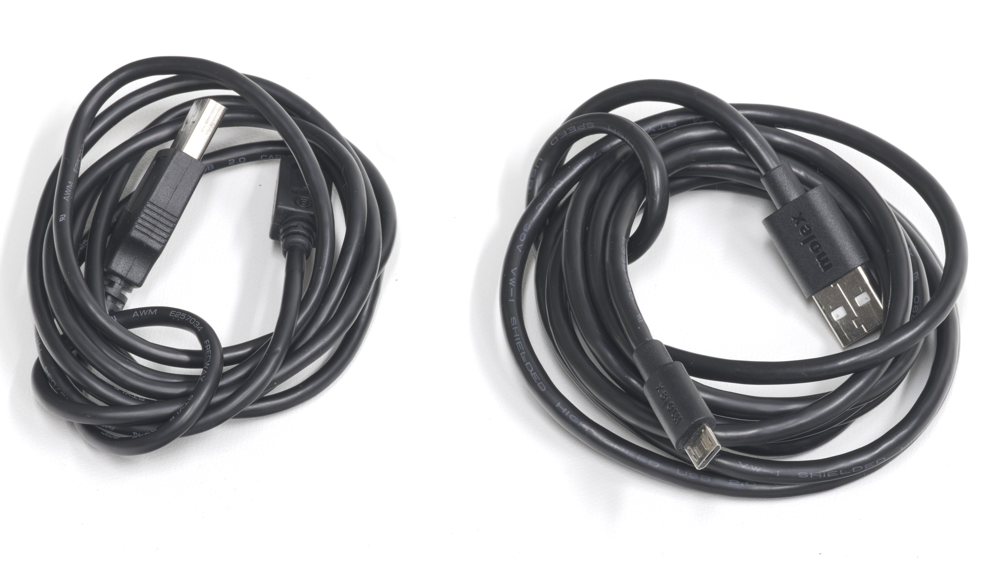
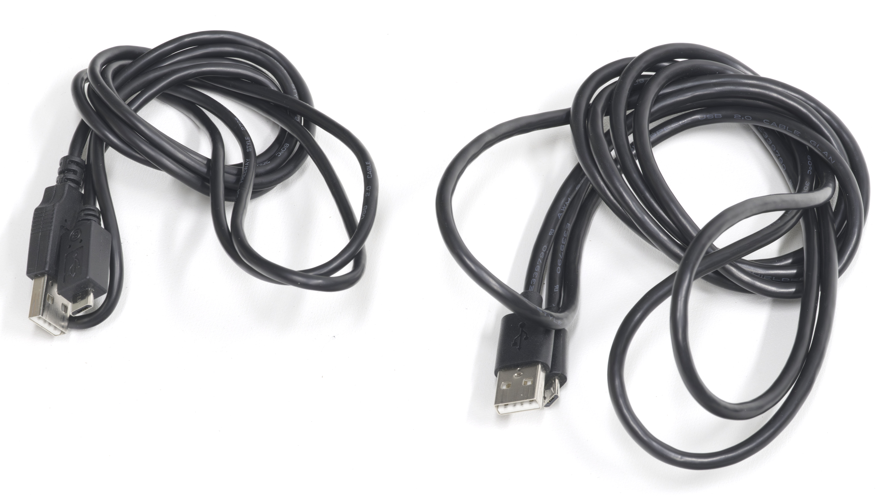
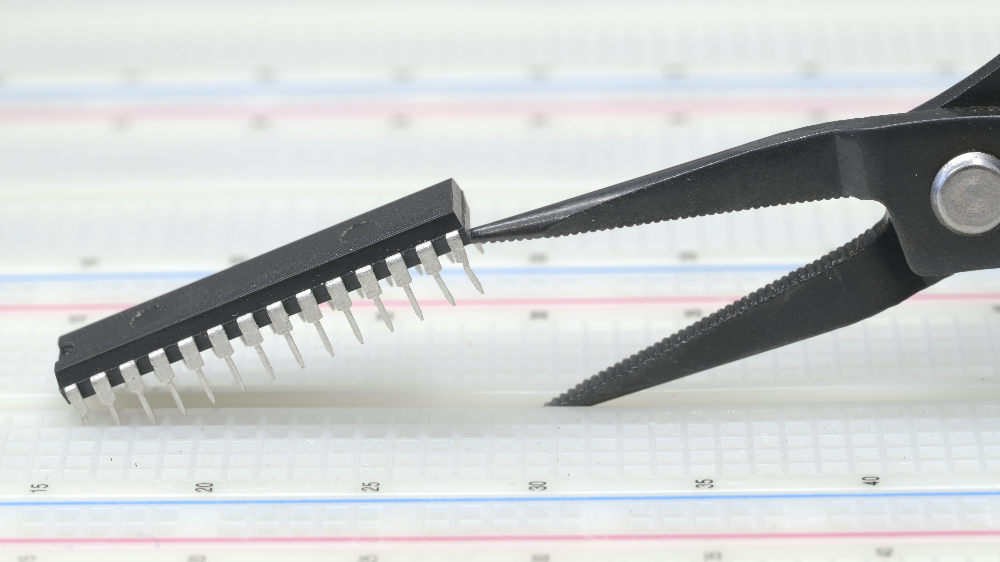
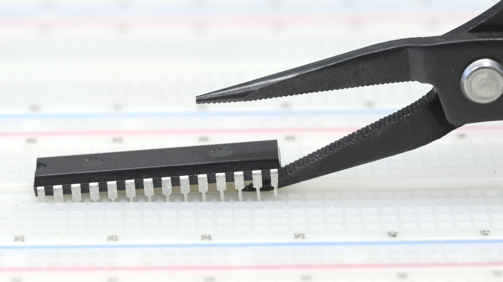

## Kit contents

The kit contains all the major components and tools that you will definitely need a fixed quantity of. Exact parts and counts are listed in this document.

The kit does not contain the small, uncountable and consumable components - these are instead found at the component store at the lab. Take what you need when you need it, and return only parts in working order.

## When returning the kit

You are not merely returning the kit, but also preparing it for next year. As such, the only acceptable condition upon delivery is perfection.

You will not get access to the exam before the kit has been accepted for return.

- Delivery requires exact component counts, placed in the assigned location in the kit (the three layers, or the correct position in the divider tray).
- Components on the ESD mat must be placed in the correct location - consult the photo below. Take a new mat from the component store if it is starting to fray.
- All surplus components must be returned to the component store.
- Any foreign components (things you have brought yourself) shall not be handed in.
- Any missing components should be resupplied from the component store if possible. If something is not in the component store, you should instead make a note of what is missing, and place it on the outside of the box (post-it notes are found on the student-assistant desk).
- Passive components (resistors and capacitors) you took from the component store at the lab should only be returned if you consider them usable for next year. You should discard any components that are too short or too crooked.
- There are no expectations for the wires in the jumper wire kit - return only what you consider useful for next year's groups.

| Kit pos.  | Manufacturer part name | Description                   | Count     |
|:----------|:-----------------------|:------------------------------|:---------:|
| Mat       | ATMega162              | Microcontroller               | 1         |
| Mat       | MAX233                 | Serial transceiver            | 1         |
| Mat       | ALS573CN               | Latch                         | 1         |
| Mat       | HC00N                  | NAND gate                     | 1         |
| Mat       | IDT7164S20TPG          | SRAM 64k                      | 1         |
| Mat       | MAX156BCNG+            | ADC                           | 1         |
| Mat       | MCP2515                | CAN controller                | 1         |
| Mat       | MCP2551                | CAN transceiver               | 1         |
| Mat       | MCP602                 | OpAmp                         | 2         |
| Mat       | MC7805CT               | Voltage regulator             | 1         |
| Mat       | Euroquartz HC49/4H/30  | 4.9152MHz Crystal             | 1         |
| Mat       | Euroquartz HC49/4H/30  | 16MHz Crystal                 | 1         |
| Mat       | RG2L-5VDC              | Relay                         | 1         |
| Mat       | 3CTL9                  | Switch                        | 1         |
| Mat       | MPSA56                 | Transistor                    | 1         |
| Mat       | TSHA5200               | IR emitter (clear)            | 1         |
| Mat       | SFH203-FA              | IR photodiode (black)         | 1         |
| Mat       | HLMP 1340              | Red LED                       | 3         |
| Mat       | 1N4005                 | Diode                         | 2         |
| Mat       | MKS2C041001F00KSSD     | Wima Film Capacitor 1uF (5mm) | 1         |
| Tray W    | Arduino Due            | Arduino Due w/ custom shield  | 1         |
| Tray W    | TW-E40-510             | Mini breadboard               | 1         |
| Tray W    | Multicomp 038-0016     | ESD component mat             | 1         |
| Tray W    | (Mat)                  | *(Mat with components)*       | 1         |
| Tray S    |                        | Atmel ICE                     | 1         |
| Tray S    |                        | ICE 50-mil 10-pin mini squid cable | 1     |
| Tray S    |                        | ICE Adapter board             | 1         |
| Tray SE   | SparkFun PRT-10367     | Rainbow cable 2-pin 6"        | 4         |
| Tray SE   | SparkFun PRT-10372     | Rainbow cable 2-pin 12"       | 5         |
| Tray SE   | SparkFun PRT-10373     | Rainbow cable 3-pin 12"       | 1         |
| Tray SE   | SparkFun PRT-10375     | Rainbow cable 5-pin 12"       | 1         |
| Tray SE   | SparkFun PRT-10376     | Rainbow cable 6-pin 12"       | 2         |
| Tray NE   | Amphenol FC14600-0     | 14p IDC (7x2) 60cm            | 1         |
| Tray NE   | Amphenol FC10600-0     | 10p IDC (5x2) 60cm            | 2         |
| Tray NE   | Amphenol FC10150-0     | 10p IDC (5x2) 15cm            | 3         |
| Tray NE   | Amphenol FC06600-0     | 6p IDC (3x2) 60cm             | 1         |
| Tray N    | (custom)               | 10p male IDC to 10x 1p squid  | 1         |
| Tray N    | (custom)               | 10p female IDC to 5x 2p squid | 1         |
| Tray N    | (custom)               | DSUB9 to breadboard           | 1         |
| Tray N    | (custom)               | 5x2 to breadboard unshrouded  | 2         |
| Tray N    | (custom)               | 5x2 to breadboard shrouded    | 2         |
| Tray N    | (custom)               | 7x2 to breadboard shrouded    | 1         |
| Tray N    | Multicomp 27.187.1     | Crocodile clip                | 2         |
| Bottom    | (Tray)                 | *(Tray with components and cables)* | 1     |
| Middle    | SPC20040 (or equiv.)   | 9p-9p DSUB cable 1.8m         | 1         |
| Middle    | USB micro-B, 1.8m      | For Atmel ICE                 | 1         |
| Middle    | USB micro-B            | For Arduino Due               | 1         |
| Middle    | (custom)               | Motor power cable 60cm        | 1         |
| Middle    | K&H KS-350             | Jumper wire kit               | 1         |
| Top       | Multicomp MCBB3060     | Main breadboard               | 1         |
| Top       | Proskit 8PK-102D       | Long nose plier               | 1         |
| Top       | Proskit 8PK-30D        | Micro cutting plier           | 1         |
| Top       | (custom)               | User IO-board                 | 1         |

**Component mat**

**Tray contents**

**Bottom layer (tray)**

**Middle layer (cables, wire kit)**

**Top layer (breadboard, tools, IO-board)**

> Cables should be folded and tied in a single knot:

| ✗ Connectors should never be fed through a cable loop | ✓ Single knots only |
|:---:|:---:|
|  |  |

> Do not bend the legs of DIP components when removing them:

| ✗ Do not lift one side too high | ✓ Lift one side slightly, then lift the other |
|:---:|:---:|
|  |  |