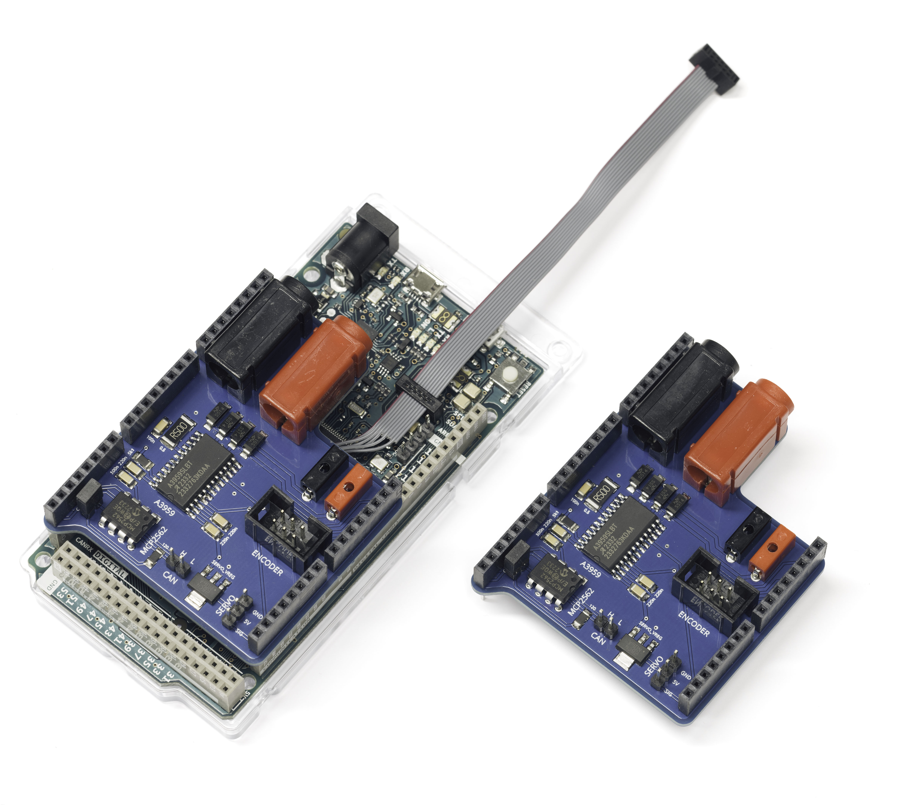
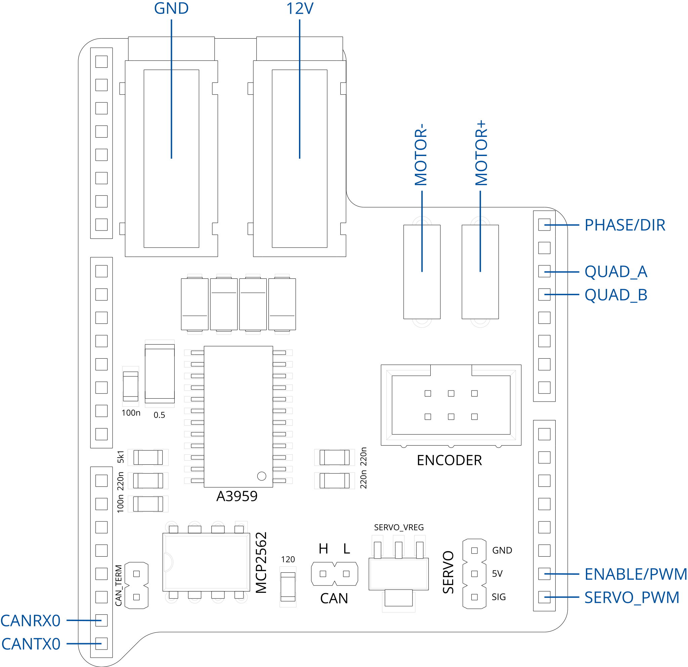

For use with Arduino Due and the TTK4155 ping-pong board

## Pinout

## Motor driver

The motor shield uses the [Allegro A3959](A3959-Datasheet.pdf) as its motor driver, which is a single full-bridge DMOS driver with internal current sensing and chopping. This driver also has several configurable modes of operation, but these have been hard-wired on the motor shield.

### Basic usage

The motor driver interface is "phase/enable", which in practice means "direction and speed (PWM)". To drive the motor, you must:

- Supply a voltage to the 4mm banana sockets (9V - 12V)
- Apply a PWM signal to the ENABLE/PWM pin (any frequency below 50 kHz)
- Apply a high or low signal to the PHASE/DIR pin

The ENABLE/PWM pin is connected to Arduino pin D20, or ATSAM3X8E pin PB12. PWM out on PB12 is set with alternate function B on PIOB, and frequency/duty cycle is set on PWM channel 0 (see [table 38-2 of ATSAM3X8E docs](https://ww1.microchip.com/downloads/en/DeviceDoc/Atmel-11057-32-bit-Cortex-M3-Microcontroller-SAM3X-SAM3A_Datasheet.pdf#G29.1143972)).

The PHASE/DIR pin is connected to Arduino pin D7, or ATSAM3X8E pin PC23.

> [!WARNING]
> Connecting a motor driver output (MOTOR- / MOTOR+) to ground (including an oscilloscope probe ground reference) will immediately fry that output channel.

### Hard-wired configuration

The configuration pins are hard-wired according to the table below:

| Pin           | Value   | Meaning                                                        |
|:--------------|:-------:|:---------------------------------------------------------------|
| EXT MODE      | 0       | "Fast" current decay mode when ENABLE/PWM is low               |
| PFD1 / PFD2   | 0       | "Slow" current decay mode after trip current is detected       |
| BLANK         | 0       | Fast re-enable of current sensing after a driver turns on      |
| ROSC          | 0       | Default 4 MHz internal clock                                   |
| REF / SENSE   | 5V / 0.5 Ω | 1A trip current                                             |
| SLEEP         | 5k1 Ω   | Driver is always enabled                                       |

## Quadrature encoder

| GND | ChA | ChB |
|:---:|:---:|:---:|
| 4   | 2   | 0   |
| 5   | 3   | 1   |
| GND |     | 3V3 |

The quadrature encoder input is pin-matched with the header on the ping-pong board. You should only need to connect a 6-pin IDC cable directly.

The two channels are connected to Arduino pins D4 and D5, or ATSAM3X8E pins PC26 and PC25.

> [!NOTE]
<i>Note an omission in the Arduino pinout documentation! D4/PWM4 is connected to BOTH PC26 and PA29!</i>

PC25/26 are used by channel 0 of TC2 when in quadrature decoder mode (see [table 36-4 of ATSAM3X8E docs](https://ww1.microchip.com/downloads/en/DeviceDoc/Atmel-11057-32-bit-Cortex-M3-Microcontroller-SAM3X-SAM3A_Datasheet.pdf#G27.1073758)).

Quadrature decoder mode requires setting the block mode register, which will change the operating mode of the entire TC2 instance. You must also set XC0 as the selected clock for channel 0.

## Servo

| Pin | Function |
|:---:|:---------|
| 0   | GND      |
| 1   | 5V       |
| 2   | SIGNAL   |

The servo output is pin-matched to a standard servo pinout.

5V is supplied from the LM1117 voltage regulator, connected directly to the 4mm banana power input plugs. Because servo motors have very spiky current draws, it is highly recommended to use 5V supply from this regulator, instead of the Arduino itself.

You are recommended to connect the servo header to the mini breadboard with a 3-pin cable, then use a shrouded breadboard-to-10-pin adapter and a long 10-pin IDC cable to the IO header of the ping-pong board.

SIGNAL is connected to Arduino pin D21, or ATSAM3X8E pin PB13. PWM out on PB13 is set with alternate function B on PIOB, and frequency/duty cycle is set on PWM channel 1 (see [table 38-2 of ATSAM3X8E docs](https://ww1.microchip.com/downloads/en/DeviceDoc/Atmel-11057-32-bit-Cortex-M3-Microcontroller-SAM3X-SAM3A_Datasheet.pdf#G29.1143972)).

- The servo PWM frequency should be 50 Hz (20 ms).
- The duty cycle should be between 0.9 and 2.1 ms.

> [!WARNING]
> SERVO_VREG can get hot when the servo is under high load!

## CAN

| CANH | CANL |
|:----:|:----:|
| 0    | 1    |

The CAN header is connected to a MCP2562 CAN transceiver, which in turn is connected to the Arduino CANRX0/D68 and CANTX0/D69 pins. These are controlled from the CAN0 instance on the ATSAM3X8E.

The CAN_TERM header will connect the terminating 120Ω resistor between CANH and CANL. Disconnect this header if the shield is not at a terminating end of a CAN bus.

## About motor drivers

*This section is for nerds only, there is nothing "need-to-know" here...*

DC Motor drivers are all based around the H-bridge, but how these are controlled vary in two major ways:

- The exposed user interface
  - Phase/enable, using a single PWM input and a direction input
  - Parallel, using a PWM input for each side of a dual half-bridge
  - Digital, eg I2C, SPI, UART, or CAN
- Internal control or direct control
  - Direct control: the PWM signal(s) are applied directly to the H-bridge
  - Internal control: the H-bridge is controlled by the chip, and uses the PWM input(s) as a reference for the control logic

The A3959 is a phase/enable driver with internal control. This means that the output of the H-bridge is not just a function of the PWM signal applied to the ENABLE pin, but also the sensed current, and internal timers. Current sensing is done by measuring the voltage across a low-resistance resistor, and timers use an internal oscillator.

### How it works

When the ENABLE signal is high, a sink-source pair of DMOS outputs (depending on the direction) are enabled, applying the 12V voltage across the motor. This causes the motor to draw current, generate torque with the current, start turning, and pick up speed. But a spinning motor is also a generator, which generates a back EMF (reverse voltage), which in turn reduces the current draw until equilibrium is achieved.

Disabling the DMOS outputs of the H-bridge will stop supplying voltage to the motor. But a motor is an inductive load, which means it resists change in current, so current is still flowing through the motor. This decaying current has to go somewhere. This is why H-bridges have reversing diodes, though we can also open the DMOS outputs to direct the current. This is what "fast" or "slow" current decay modes determine.

With "slow" current decay mode, both sink outputs (the ones attached to ground) are enabled, effectively short-circuiting across the motor. This only works because the transistors can let current flow in either direction. All the current generated by the free-spinning motor will be used to power the motor in the reverse direction. This is effectively a motor brake. This is called "slow", because the current is allowed to re-circulate for as long as possible.

With "fast" current decay mode, the opposite pair of DMOS outputs are enabled. The reason the reverse pair is enabled - instead of just letting the current run through the diodes - is because the transistors can take more current without overheating. Since enabling the reverse pair applies the 12V source voltage in the opposite direction, the inductive current in the motor will be forced to decay more quickly, though the motor will eventually start spinning the other way.

The method of alternating which DMOS outputs are enabled depending on the sensed current is known as "current chopping". This occurs both when the ENABLE pin is high (the on-period of the user's PWM input) and when it goes low, but for different reasons.

When ENABLE goes low, fast or slow current decay mode is selected with EXT MODE - in our case set to fast decay. With fast decay, the reverse pair is enabled. To prevent the motor from starting to spin the other way, the reverse pair is enabled alternatingly with the driving pair until the current is driven to zero. This method of forcing the current to zero also forces the motor back-EMF to zero, which means that the spinning motor does not act as a generator for its own brake, and so the motor will appear to "coast" for a while. If EXT MODE was set to slow decay, the two sink DMOS outputs would be enabled without any chopping, and the short-circuit braking behavior would make the motor come to a rapid stop.

When ENABLE goes high, the voltage we apply will cause the current to increase, to the point where an overcurrent might be detected. There is a high initial current draw if the motor starts from stationary, since it does not generate any back EMF yet. This is the reason for the BLANK timer - it prevents the overcurrent sensing from being erroneously tripped just after the ENABLE pin goes high.

But if a current over the trip threshold is detected after the blanking duration, the outputs are disabled for a fixed duration. During this fixed off time, fast, slow, or mixed current decay modes can be used to lower the current below the trip threshold. This is configured by the PFDn pins - in our case, both set to 0 for slow decay.

Since the response to overcurrent is a fixed-duration off time, the slow decay will make the current decay less than it would with fast decay. The "braking" effect of slow decay does not have enough time to manifest, whereas the current-lowering effect of the reversed inputs of fast decay has a bigger effect. This means that slow decay will stay closer to the trip current value than fast decay would, and as such we get a higher speed from the motor at the same ENABLE/PWM input with slow decay mode on overcurrent.

Why not also use slow decay mode for the off-period of the user's PWM input? This would make the motor responsive not just to acceleration, but also deceleration. But it would also make your PID controller have no real need for the I and D terms...

### Heat generation and current sensing

A driver with internal current sensing and control has benefits for heat generation on two major ways. The first and most obvious one is that you - the user - are unable to overcurrent the device, and therefore (almost) guaranteed to be unable to overheat the device. This is configured entirely in hardware, with the current sensing resistor (SENSE) and the current reference pin (REF).

Second is that a driver that doesn't do current chopping and guides decaying current though its DMOS gates will instead have to rely entirely on the relatively higher-resistance reversing diodes. Such a driver will generate most of its heat at about some middle-ish PWM width, as this maximizes the amount of current that has to go through the highest resistance pathways (any lower and there's not a lot of current in the first place, any higher and the current is mostly going forward across the DMOS gates). Since the whole point of PWM input is to make use of the range of "middle" speeds, this can be a serious drawback of such simple motor drivers.

If you want external current sensing, for example if you want to do torque feedback control, you may have a hard time without dedicated hardware for this. The current from any kind of PWM applied to a motor will look a bit like a triangle wave (a series of approximately first-order increases and decreases), so getting a good sample reading is very difficult. For a driver with internal control and even higher output frequencies, this becomes even harder, since you cannot set your own frequencies and adjust the current sensing timing to consistently correlate with the driver on- and off-events. In short - if you want a torque control driver or a stepper motor driver with microstepping, you should use dedicated hardware for this instead of trying to do it in software.

## Schematic & PCB

[Download schematic (PDF)](toppkort-A3959-basic-v8.pdf)

<embed src="toppkort-A3959-basic-v8.pdf" width="100%" style="aspect-ratio:1.33;" type="application/pdf">

**Top copper**



**Bottom copper**

