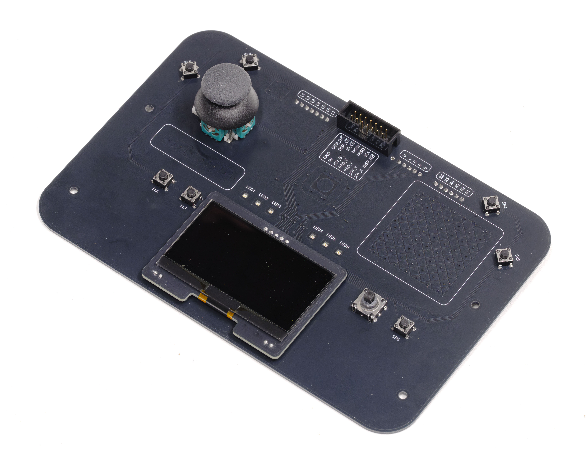

Joystick, touch, and display module<br>with analog and SPI interface



## Pinout

### Main box header

| 0 | 1 | 2 | 3 | 4 | 5 | 6 |
|:--:|:--:|:--:|:--:|:--:|:--:|:--:|
| 7 | 8 | 9 | 10 | 11 | 12 | 13 |
| GND | 5V | JOY_B | PAD_Y | PAD_X | JOY_Y | JOY_X |

| Pin No. | Symbol | Function |
|:-------:|:-------|:---------|
| 0 | DISP_D/C̄ | Display data/command select<br>When high, SPI data is interpreted as display pixel data<br>When low, SPI data is interpreted as a command<br>See [SSD1309 data sheet](https://www.hpinfotech.ro/SSD1309.pdf#page=27) for command table |
| 1 | DISP_CS̄ | Display chip select<br>When low, the display accepts data or command bytes over SPI |
| 2 | IO_CS̄ | AVR chip select<br>When low, the [AVR accepts commands](#avr) over SPI |
| 3 | MOSI | SPI master output<br>Connected to both display and AVR |
| 4 | MISO | SPI master input<br>Connected only to AVR |
| 5 | SCK | SPI clock |
| 6 | DISP_RES̄ | Display module reset<br>When low, display module is reset and blanked<br>Can be connected to host MCU reset line, or permanently tied to 5V |
| 7 | GND | Power ground |
| 8 | 5V | Power 5V |
| 9 | JOY_B | Joystick center button<br>GND when button is pressed, NC otherwise |
| 10 / 11 | PAD_Y / PAD_X | Touch pad XY analog output (0-5V)<br>*Analog signal is from a low-pass filtered PWM signal, and may therefore have some noise* |
| 12 / 13 | JOY_Y / JOY_X | Joystick XY analog output (1-4V)<br>*Joystick potentiometers are protected against accidental short circuit with resistors R4-R7* |

### Button headers

Tactile switches and 5-way navigation stick can be accessed through their individual headers.

Buttons are No Connection when not pressed, and GND when pressed. Reading these over the header requires configuring pin pullup on your MCU.

> [!WARNING]
> Accidentally feeding 5V into one of these pins and pressing the corresponding button will create a short circuit, at least until the resettable fuse R3 reacts.

> [!NOTE]
> The pin between the main box header and the 5-way navigation joystick is the AVR's UPDI pin, used for flashing firmware to the board.

## SPI commands

The SPI bus is connected to both the AVR and display module

> [!WARNING]
> Be sure to not enable the AVR chip select simultaneously with another SPI slave, as it could cause short circuits when multiple chips try to use the MISO line.

### Display

The display interprets incoming SPI traffic as either data or commands, depending on the value of DISP_D/C̄.

[See the SSD1309 data sheet](https://www.hpinfotech.ro/SSD1309.pdf) for a complete description of commands, and how it interprets data into pixels.

You will likely want to rotate the display by flipping the display both horizontally (segment remap `A1`) and vertically (scan direction `C8`).

Recommended minimal initialization:

```text
A1 (segment remap)
C8 (scan direction)
AF (output enable)
```

> [!NOTE]
> The display has three main addressing modes for interpreting pixel data. See the [Memory Addressing Mode command](https://www.hpinfotech.ro/SSD1309.pdf#page=32) `20` and remaining indexing operations on page 32 of the SSD1309 datasheet. It's easiest to use page mode (default), and commands for setting the page (`B0`) and column (`00` and `10`).

### AVR

The AVR operates in SPI slave mode, and allows access to all other features of the user IO-board.

Each operation consists of one command byte, and one or more data bytes.

| Function | Command | Data |
|:---------|:--------|:-----|
| Touch pad | `0x01` (read) | `X` `Y` `size`<br>*`size` is the signal strength of the touch pad, and approximately corresponds to the proportion of the pad being touched.* |
| Touch slider | `0x02` (read) | `X` `size` |
| Joystick | `0x03` (read) | `X` `Y` `btn` |
| Buttons | `0x04` (read) | `right` `left` `nav`<br>*The three bytes contain the following bits, from MSB to LSB:*<br>`right`: `[0 0 R6 R5 R4 R3 R2 R1]`<br>`left`: `[0 L7 L6 L5 L4 L3 L2 L1]`<br>`nav`: `[0 0 0 Up Down Left Right Btn]` |
| LED on/off | `0x05` (write) | `LED_N` `on/off`<br>*Where `LED_N` is among 0 to 5<br>and `on/off` with a value other than 0 will turn on the LED* |
| LED PWM | `0x06` (write) | `LED_N` `width`<br>*Where `LED_N` is among 0 to 5<br>and `width` is the PWM width (255 for max brightness)* |
| Info | `0x07` (read) | 35 bytes total:<br>First 19 bytes: Firmware compile timestamp (YYYY-MM-DDTHH:mm:ss)<br>Last 16 bytes: AVR serial number |

> [!NOTE]
> SPI transfers to the AVR have the following timing constraints:
>
> - 40 µs minimum interval between command byte and first data byte
> - 2 µs minimum interval between two data bytes for read-commands
>
> *The interval is between the end of the final bit of one byte to the start of the first bit of the next.*
>
> This can be acheived by either introducing `_delay_us()` commands between SPI transfers, or by reducing the SPI clock speed sufficiently.

> [!NOTE]
> You can unpack button bytes using bitfields within a union, optionally within a struct:

```c
typedef struct __attribute__((packed)) {
    union {
        uint8_t right;
        struct {
            uint8_t R1:1;
            uint8_t R2:1;
            uint8_t R3:1;
            uint8_t R4:1;
            uint8_t R5:1;
            uint8_t R6:1;
        };
    };
    union {
        uint8_t left;
        struct {
            uint8_t L1:1;
            uint8_t L2:1;
            uint8_t L3:1;
            uint8_t L4:1;
            uint8_t L5:1;
            uint8_t L6:1;
            uint8_t L7:1;
        };
    };
    union {
        uint8_t nav;
        struct {
            uint8_t NB:1;
            uint8_t NR:1;
            uint8_t ND:1;
            uint8_t NL:1;
            uint8_t NU:1;
        };
    };
} Buttons;
```

## Schematic & PCB

[Download schematic (PDF)](schematic.pdf)

<embed src="schematic.pdf" width="100%" style="aspect-ratio:0.70;" type="application/pdf">

**Top copper**



**Bottom copper**

